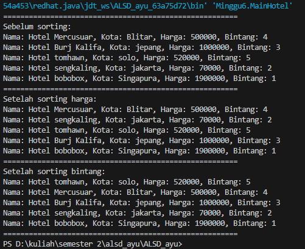

## 
 LAPORAN HASIL PRAKTIKUM JOBSHEET 5

 

 
  Nama : Nur Ayu Lailatul Azizah
 
  Kelas : TI 1 H
 
  NIM : 2341720044

 Jln.Soekarno Hatta No.9, Jatimulyo, Kec. Lowokwaru, Kota Malang, Jawa Timur 6

Phone: (0341) 404424,404425

E-mail: Polinema.ac.id

## 
 JOBSHEET V
## 
 SORTING (BUBBLE, SELECTION, DAN INSERTION SORT)

#### 2.1 Percobaan 1: Mengurutkan Data Mahasiswa Berdasarkan IPK Menggunakan Bubble Sort

- Hasil Program

package Minggu6;
import java.util.Scanner;

public class Mahasiswa {
    String nama;
    int thnMasuk, umur;
    double ipk;

    Mahasiswa(String n, int t, int u, double i) {
        nama = n;
        thnMasuk = t;
        umur = u;
        ipk = i;
    }

    void tampil() {
        System.out.println("Nama = " + nama);
        System.out.println("Tahun Masuk = " + thnMasuk);
        System.out.println("Umur = " + umur);
        System.out.println("IPK = " + ipk);
    }
}

class DaftarMahasiswaBerprestasi {
    Mahasiswa listMhs[] = new Mahasiswa[5];
    int idx;

    void tambah(Mahasiswa m) {
        if(idx < listMhs.length) {
            listMhs[idx] = m;
            idx++;
        } else {
            System.out.println("Data sudah penuh!!");
        }
    }

    void tampil() {
        for(Mahasiswa m : listMhs) {
            m.tampil();
            System.out.println("-------------------------------------------");
        }
    }

    void bubbleSort() {
        for(int i = 0; i < listMhs.length-1; i++) {
            for(int j = 1; j < listMhs.length-i; j++) {
                if(listMhs[j].ipk > listMhs[j-1].ipk) {
                    Mahasiswa tmp = listMhs[j];
                    listMhs[j] = listMhs[j-1];
                    listMhs[j-1] = tmp;
                }
            }
        }
    }

     public static class main {
        public static void main(String[] args) {
            DaftarMahasiswaBerprestasi list = new DaftarMahasiswaBerprestasi();

            Mahasiswa m1 = new Mahasiswa ("Nusa", 2017, 25, 3);
            Mahasiswa m2 = new Mahasiswa ("Rara", 2012, 19, 4);
            Mahasiswa m3 = new Mahasiswa ("Dompu", 2018, 19, 3.5); 
            Mahasiswa m4 = new Mahasiswa ("Abdul", 2017, 23, 2);
            Mahasiswa m5 = new Mahasiswa ("Ummi", 2019, 21, 3.75);

            list.tambah (m1);
            list.tambah (m2);
            list.tambah (m3);
            list.tambah (m4);
            list.tambah (m5);

            System.out.println("Data mahasiswa sebelum sorting = "); 
            list.tampil();

            System.out.println("Data mahasiswa setelah sorting asc berdasarkan ipk");
            list.bubbleSort();
            list.tampil();
        }
     }
}

- Verifikasi Hasil Percobaan

- Pertanyaan
1. Terdapat di method apakah proses bubble sort?
2. Di dalam method bubbleSort(), terdapat baris program seperti di bawah ini:
if(listMhs[j].ipk > listMhs[j-1].ipk) {
    MAhasiswa tmp = listMhs[j];
    listMhs[j] = listMhs[j-1];
    listMhs[j-1] = tmp;
}
Untuk apakah proses tersebut?
3. Perhatikan perulangan di dalam bubbleSort() di bawah ini:
for(int i = 0; i < listMhs.length-1; i++) {
    for(int j = 1; j < listMhs.length-i; j++>) {   
a. Apakah perbedaan antara kegunaan perulangan i dan perulangan j?
b. Mengapa syarat dari perulangan i adalah i<listMhs.length-1 ?
c. Mengapa syarat dari perulangan j adalah j<listMhs.length-i ?
d. Jika banyak data di dalam listMhs adalah 50, maka berapakali perulangan i akan berlangsung? Dan ada berapa Tahap bubble sort yang ditempuh?
     
- Jawaban 
1. Di dalam kelas DaftarMahasiswaBerprestasi, proses bubble sort terjadi di dalam metode bubbleSort().
2. Blok kode tersebut bertanggung jawab untuk menukar posisi dua elemen dalam array jika kriteria tertentu terpenuhi, dalam hal ini, jika IPK mahasiswa pada indeks j lebih besar dari IPK mahasiswa pada indeks j-1.
3. a. Perulangan i digunakan untuk mengontrol iterasi pada setiap langkah utama dalam algoritma bubble sort. sedangkan perulangan j digunakan untuk membandingka elemen elemen di dalam array dan menukar posisinya jika diperlukan.
b. karena pada setiap iterasi, algoritma hanya perlu melakukan (panjang array - 1) langkah.
c. karena pada setiap iterasi i satu elemen terakhir dari array sudah pasti berada di posisi yang benar.
d. akan berlangsung sebanyak 49 kali, dan ada 49 tahap bubble sort yang harus ditempuh.

#### 2.2 Percobaan 2: Mengurutkan Data Mahasiswa Berdasarkan IPK Menggunakan Selection Sort

- Hasil Program

package Minggu6;
import java.util.Scanner;

public class Mahasiswa {
    String nama;
    int thnMasuk, umur;
    double ipk;

    Mahasiswa(String n, int t, int u, double i) {
        nama = n;
        thnMasuk = t;
        umur = u;
        ipk = i;
    }

    void tampil() {
        System.out.println("Nama = " + nama);
        System.out.println("Tahun Masuk = " + thnMasuk);
        System.out.println("Umur = " + umur);
        System.out.println("IPK = " + ipk);
    }
}

class DaftarMahasiswaBerprestasi {
    Mahasiswa listMhs[] = new Mahasiswa[5];
    int idx;

    void tambah(Mahasiswa m) {
        if(idx < listMhs.length) {
            listMhs[idx] = m;
            idx++;
        } else {
            System.out.println("Data sudah penuh!!");
        }
    }

    void tampil() {
        for(Mahasiswa m : listMhs) {
            m.tampil();
            System.out.println("-------------------------------------------");
        }
    }

    void selectionSort() {
        for(int i = 0 ; i < listMhs.length-1; i++){
            int idxMin = i;
            for(int j= i+1; j < listMhs.length; j++){
                if(listMhs[j].ipk < listMhs[idxMin].ipk) { 
                    idxMin = j;
                    }
                }

                Mahasiswa tmp = listMhs [idxMin];
                listMhs[idxMin] = listMhs[i];
                listMhs[i] = tmp;
            }
        }

     public static class main {
        public static void main(String[] args) {
            DaftarMahasiswaBerprestasi list = new DaftarMahasiswaBerprestasi();

            Mahasiswa m1 = new Mahasiswa ("Nusa", 2017, 25, 3);
            Mahasiswa m2 = new Mahasiswa ("Rara", 2012, 19, 4);
            Mahasiswa m3 = new Mahasiswa ("Dompu", 2018, 19, 3.5); 
            Mahasiswa m4 = new Mahasiswa ("Abdul", 2017, 23, 2);
            Mahasiswa m5 = new Mahasiswa ("Ummi", 2019, 21, 3.75);

            list.tambah (m1);
            list.tambah (m2);
            list.tambah (m3);
            list.tambah (m4);
            list.tambah (m5);

            System.out.println("Data mahasiswa sebelum sorting = "); 
            list.tampil();

            System.out.println("Data mahasiswa setelah sorting asc berdasarkan ipk");
            list.selectionSort();
            list.tampil();
        }
     }
}

- Verifikasi Hasil Percobaan

- Pertanyaan
1. Di dalam method selection sort, terdapat baris program seperti di bawah ini:
int idxMin = 1;
for(int j = i + 1; j < listMhs.length; j++) {
    if(listMhs[j].ipk < listMhs[idxMin].ipk) {
        idxMin = j;
    }
}
Untuk apakah proses tersebut, jelaskan!
   
- jawaban
1. proses tersebut merupakan bagian dari algoritma selection sort yang bertujuan untuk mencari indeks elemen dengan nilai terkecil didalam array ang belum diurutkan.

#### 2.3 Percobaan 3: Mengurutkan Data Mahasiswa Berdasarkan IPK Menggunakan Insertion Sort

- Hasil Program

package Minggu6;
import java.util.Scanner;

public class Mahasiswa {
    String nama;
    int thnMasuk, umur;
    double ipk;

    Mahasiswa(String n, int t, int u, double i) {
        nama = n;
        thnMasuk = t;
        umur = u;
        ipk = i;
    }

    void tampil() {
        System.out.println("Nama = " + nama);
        System.out.println("Tahun Masuk = " + thnMasuk);
        System.out.println("Umur = " + umur);
        System.out.println("IPK = " + ipk);
    }
}

class DaftarMahasiswaBerprestasi {
    Mahasiswa listMhs[] = new Mahasiswa[5];
    int idx;

    void tambah(Mahasiswa m) {
        if(idx < listMhs.length) {
            listMhs[idx] = m;
            idx++;
        } else {
            System.out.println("Data sudah penuh!!");
        }
    }

    void tampil() {
        for(Mahasiswa m : listMhs) {
            m.tampil();
            System.out.println("-------------------------------------------");
        }
    }

    void insertionSort() {
        for (int i = 1; i < listMhs.length; i++) {
            Mahasiswa temp = listMhs[i];
            int j = i;
            while (j > 0 && listMhs[j - 1].ipk > temp.ipk) {
                listMhs[j] = listMhs[j - 1];
                j--;
            }
            listMhs[j] = temp;
        }
    }

     public static class main {
        public static void main(String[] args) {
            DaftarMahasiswaBerprestasi list = new DaftarMahasiswaBerprestasi();

            Mahasiswa m1 = new Mahasiswa ("Nusa", 2017, 25, 3);
            Mahasiswa m2 = new Mahasiswa ("Rara", 2012, 19, 4);
            Mahasiswa m3 = new Mahasiswa ("Dompu", 2018, 19, 3.5); 
            Mahasiswa m4 = new Mahasiswa ("Abdul", 2017, 23, 2);
            Mahasiswa m5 = new Mahasiswa ("Ummi", 2019, 21, 3.75);

            list.tambah (m1);
            list.tambah (m2);
            list.tambah (m3);
            list.tambah (m4);
            list.tambah (m5);

            System.out.println("Data mahasiswa sebelum sorting = "); 
            list.tampil();

            System.out.println("Data mahasiswa setelah sorting asc berdasarkan ipk");
            list.insertionSort();
            list.tampil();
        }
     }
}

- Verifikasi Hasil Percobaan
  

- Pertanyaan
1. Ubahlah fungsi pada InsertionSort sehingga fungsi ini dapat melaksanakan proses sorting
dengan cara descending

- jawaban
1. 

package Minggu6;
import java.util.Scanner;

public class Mahasiswa {
    String nama;
    int thnMasuk, umur;
    double ipk;

    Mahasiswa(String n, int t, int u, double i) {
        nama = n;
        thnMasuk = t;
        umur = u;
        ipk = i;
    }

    void tampil() {
        System.out.println("Nama = " + nama);
        System.out.println("Tahun Masuk = " + thnMasuk);
        System.out.println("Umur = " + umur);
        System.out.println("IPK = " + ipk);
    }
}

class DaftarMahasiswaBerprestasi {
    Mahasiswa listMhs[] = new Mahasiswa[5];
    int idx;

    void tambah(Mahasiswa m) {
        if(idx < listMhs.length) {
            listMhs[idx] = m;
            idx++;
        } else {
            System.out.println("Data sudah penuh!!");
        }
    }

    void tampil() {
        for(Mahasiswa m : listMhs) {
            m.tampil();
            System.out.println("-------------------------------------------");
        }
    }

    void insertionSortDesc() {
        for (int i =1; i < listMhs.length; i++) {
            Mahasiswa temp = listMhs[i];
            int j = i;
            while (j > 0 && listMhs[j-1].ipk < temp.ipk) {
                listMhs[j] = listMhs[j-1];
                j--;
            }
            listMhs[j] = temp;
        }
    }

     public static class main {
        public static void main(String[] args) {
            DaftarMahasiswaBerprestasi list = new DaftarMahasiswaBerprestasi();

            Mahasiswa m1 = new Mahasiswa ("Nusa", 2017, 25, 3);
            Mahasiswa m2 = new Mahasiswa ("Rara", 2012, 19, 4);
            Mahasiswa m3 = new Mahasiswa ("Dompu", 2018, 19, 3.5); 
            Mahasiswa m4 = new Mahasiswa ("Abdul", 2017, 23, 2);
            Mahasiswa m5 = new Mahasiswa ("Ummi", 2019, 21, 3.75);

            list.tambah (m1);
            list.tambah (m2);
            list.tambah (m3);
            list.tambah (m4);
            list.tambah (m5);

            System.out.println("Data mahasiswa sebelum sorting = "); 
            list.tampil();

            System.out.println("Data mahasiswa setelah sorting asc berdasarkan ipk");
            list.insertionSortDesc();
            list.tampil();
        }
     }
}

#### 2.4 Latihan Praktikum

- Hasil Program
  
package Minggu6;

public class Hotel {
    String nama;
    String kota;
    int harga;
    Byte bintang;

    public Hotel(String n, String k, int h, byte b) {
        nama = n;
        kota = k;
        harga = h;
        bintang = b;
    }
}

class HotelService {
    Hotel [] rooms = new Hotel [5];
    int hitung = 0;

    void tambah (Hotel H) {
        if (hitung < rooms.length) {
            rooms [hitung] = H;
            hitung++;
        } else {
            System.out.println("Maaf, kamar sudah penuh!");
        }
    }

    void tampilAll() {
        for (Hotel room : rooms) {
                System.out.println("Nama: " + room.nama + ", Kota: " + room.kota + ", Harga: " + room.harga + ", Bintang: " + room.bintang);
        }
    }

    void bubbleSortByPrice() {
        for (int i = 0; i < hitung - 1; i++) {
            int idxMax = i;
            for (int j = i; j < hitung - i - 1; j++) {
                if (rooms[j].harga > rooms [j + 1].harga) {
                    Hotel temp = rooms[j];
                    rooms[j] = rooms [j + 1];
                    rooms [j + 1] = temp;
                }
            }
        }
    }

    void selectionSort() {
        for (int i = 0; i < hitung - 1; i++) {
            int idxMax = i;
            for (int j = i+1; j < hitung; j++) {
                if (rooms[j].bintang > rooms [idxMax].bintang) {
                    idxMax = j;
                }
            }
            Hotel temp = rooms [idxMax]; 
            rooms [idxMax] = rooms[i];
            rooms [i] = temp;
        }
    }
}

class MainHotel {
    public static void main(String[] args) {

        HotelService hotelService = new HotelService();
        Hotel hotell = new Hotel ("Hotel Mercusuar", "Blitar", 500000, (byte) 4); 
        Hotel hotel2 = new Hotel ("Hotel Burj Kalifa", "jepang", 1000000, (byte) 3); 
        Hotel hotel3 = new Hotel ("Hotel tomhawn", "solo", 520000,(byte) 5); 
        Hotel hotel4 = new Hotel ("Hotel sengkaling", "jakarta", 70000, (byte) 2); 
        Hotel hotel5 = new Hotel ("Hotel bobobox", "Singapura", 1900000, (byte ) 1);

        hotelService.tambah (hotell); 
        hotelService.tambah (hotel2); 
        hotelService.tambah (hotel3); 
        hotelService.tambah (hotel4); 
        hotelService.tambah (hotel5);

        System.out.println("=======================================================");
        System.out.println("Sebelum sorting:"); 
        hotelService.tampilAll();

        System.out.println("=======================================================");
        System.out.println("Setelah sorting harga:"); 
        hotelService.bubbleSortByPrice();
        hotelService.tampilAll();

        System.out.println("=======================================================");
        System.out.println("Setelah sorting bintang:");
        hotelService.selectionSort(); 
        hotelService.tampilAll();
        System.out.println("=======================================================");
    }
}

- Hasil Percobaan

