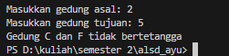
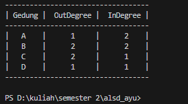

## <center> LAPORAN HASIL PRAKTIKUM JOBSHEET 15

<p align="center"> 


 <p align="center">  Nama : Nur Ayu Lailatul Azizah
 <p align="center">  Kelas : TI 1 H
 <p align="center">  NIM : 2341720044

<center> Jln.Soekarno Hatta No.9, Jatimulyo, Kec. Lowokwaru, Kota Malang, Jawa Timur 6
<center>Phone: (0341) 404424,404425
<center>E-mail: Polinema.ac.id

## <center> JOBSHEET XV
## <center> Graph

#### 2.1 Praktikum 1

- Hasil Program pencarian
``` java
package minggu15;

import java.util.Scanner;

public class percobaan {
    public static class Node21 {
        int data;
        Node21 prev, next;
        int jarak;

        Node21 (Node21 prev, int data, int jarak, Node21 next) {
        this.prev = prev;
        this.data = data;
        this.next = next;
        this.jarak = jarak;
        }
    }

    public static class DoubleLinkedList {
        Node21 head;
        int size;
    
        public DoubleLinkedList() {
            head = null;
            size = 0;
        }
    
        public boolean isEmpty() {
            return head == null;
        }

        public void addFirst(int item, int jarak) {
            if (isEmpty()) {
                head = new Node21 (null, item, jarak, null);
            } else {
                Node21 newNode = new Node21 (null, item, jarak, head);
                head.prev = newNode;
                head = newNode;
            }
            size++;
        }

        public int getJarak (int index) throws Exception {
            if (isEmpty() || index >= size) {
                throw new Exception("Nilai indeks di luar batas");
            }
            Node21 tmp = head;
            for (int i=0; i < index; i++) {
                tmp = tmp.next;
            }
            return tmp.jarak;
        }

        public int get(int index) throws Exception {
            if (isEmpty() || index >= size) {
                throw new Exception("Nilai indeks di luar batas");
            }
            Node21 tmp = head;
            for (int i = 0; i < index; i++) {
                tmp = tmp.next;
            }
            return tmp.data;
        }

        public void remove(int index) {
            Node21 current = head;
            while (current != null) {
                if (current.data == index) {
                    if (current.prev != null) {
                        current.prev.next = current.next;
                    } else {
                        head = current.next;
                    }
                    if (current.next != null) {
                        current.next.prev = current.prev;
                    }
                    break;
                }
                current = current.next;
            }
            size--;
        }

        public int size() {
            return size;
        }

        public void clear() {
            head = null;
            size = 0;
        }
    }

    public static class Graph {
    int vertex;
    DoubleLinkedList list[];

        public Graph(int v) {
                vertex = v;
                list = new DoubleLinkedList[v];
                for (int i=0; i < v; i++) {
                    list[i] = new DoubleLinkedList();
            }
        }

        public void addEdge(int asal, int tujuan, int jarak) {
            list[asal].addFirst(tujuan, jarak);
            //list[tujuan].addFirst(asal, jarak);
        }
        

        public void degree(int asal) throws Exception {
            int k, totalin = 0, totalout = 0;
                for (int i = 0; i < vertex; i++) {
                    for (int j = 0; j < list[i].size(); j++) {
                        if (list[i].get(j) == asal) {
                            ++totalin;
                        }
                    }
                for (k = 0; k < list[asal].size(); k++) {
                        list[asal].get(k);
                    }
                    totalout = k;
                }
            System.out.println("InDegree dari Gedung " + (char) ('A' +asal) + ":" + totalin); 
            System.out.println("OutDegree dari Gedung " + (char) ('A' + asal) + ":" + totalout);
            System.out.println("Degree dari Gedung " +(char) ('A' +asal)+":"+ (totalin + totalout));
            //System.out.println("Degree dari Gedung " + (char) ('A' + asal) + ": " + list[asal].size());
        }
        

        public void removeEdge (int asal, int tujuan) throws Exception {
            for (int i = 0; i < vertex; i++) {
                if (i == tujuan) {
                    list[asal].remove(tujuan);
                }
            }
        }

        public void removeAllEdges() {
            for (int i=0; i < vertex; i++) {
            list[i].clear();
            }
            System.out.println("Graf berhasil dikosongkan");
        }

        public void printGraph() throws Exception {
            for (int i=0; i < vertex; i++) { 
                if (list[i].size() > 0) {
                    System.out.println("Gedung " + (char) ('A'+ i)+" terhubung dengan ");
                    for (int j = 0; j < list[i].size(); j++) {
                        System.out.print((char) ('A' + list[i].get(j))+" ("+ list[i].getJarak(j)+"m), ");
                        }
                    System.out.println("");
                }
            }
            System.out.println("");
        }
    }

    public static void main(String[] args) throws Exception {
        Graph gedung = new Graph(6);

        gedung.addEdge(0, 1, 50); 
        gedung.addEdge(0, 2, 100);
        gedung.addEdge (1, 3, 70);
        gedung.addEdge(2, 3, 40);
        gedung.addEdge(3, 4, 60);
        gedung.addEdge(4, 5, 80);
        gedung.degree(0);
        gedung.printGraph();

        gedung.removeEdge(1, 3);
        gedung.printGraph();
    }
}
```

- Verifikasi Hasil Percobaan
- Hasil running pada langkah 14 


- Hasil running pada langkah 17


- Pertanyaan Percobaan
1. Perbaiki kode program Anda apabila terdapat error atau hasil kompilasi kode tidak sesuai!
2. Pada class Graph, terdapat atribut list[] bertipe DoubleLinkedList. Sebutkan tujuan pembuatan variabel tersebut!
3. Jelaskan alur kerja dari method removeEdge!
4. Apakah alasan pemanggilan method addFirst() untuk menambahkan data, bukan method add jenis lain saat digunakan pada method addEdge pada class Graph?
5. Modifikasi kode program sehingga dapat dilakukan pengecekan apakah terdapat jalur antara suatu node dengan node lainnya, seperti contoh berikut (Anda dapat memanfaatkan Scanner).

- jawaban
1. - 
2. - Merepresentasikan Hubungan Antar Vertex
     Setiap elemen dalam array list[] merepresentasikan sebuah vertex di dalam graf.
   - Menjaga Daftar Tetangga untuk Setiap Vertex
     Setiap elemen dalam list[] adalah sebuah DoubleLinkedList yang menyimpan tetangga-tetangga dari vertex tersebut.
   - Memudahkan Operasi pada Graf
     Dengan menggunakan adjacency list, berbagai operasi pada graf seperti menambahkan edge, menghapus edge, dan menghitung degree dapat dilakukan dengan efisien.
   - Menyimpan Informasi Jarak
     Dalam konteks graf berbobot, setiap node dalam DoubleLinkedList tidak hanya menyimpan informasi tentang tetangga tetapi juga bobot atau jarak dari vertex asal ke vertex tujuan.
3. - method menerima parameter asal dan tujuan
   - dilakukan looping untuk mengiterasi semua vertex
   - pengecekan tujuan method memeriksa apakah indeks iterasi sama dengan tujuan.
   - Jika kondisi terpenuhi (i == tujuan), method memanggil list[asal].remove(tujuan) untuk menghapus node yang memiliki data tujuan dari daftar linked list yang berhubungan dengan asal.
4. Alasan pemanggilan method addFirst() untuk menambahkan data dalam method addEdge pada class Graph adalah untuk memastikan efisiensi dan kemudahan dalam penambahan elemen baru di awal daftar linked list.
5. modifikasi program
```java
package minggu15;

import java.util.Scanner;

public class percobaan {
    public static class Node21 {
        int data;
        Node21 prev, next;
        int jarak;

        Node21 (Node21 prev, int data, int jarak, Node21 next) {
        this.prev = prev;
        this.data = data;
        this.next = next;
        this.jarak = jarak;
        }
    }

    public static class DoubleLinkedList {
        Node21 head;
        int size;
    
        public DoubleLinkedList() {
            head = null;
            size = 0;
        }
    
        public boolean isEmpty() {
            return head == null;
        }

        public void addFirst(int item, int jarak) {
            if (isEmpty()) {
                head = new Node21 (null, item, jarak, null);
            } else {
                Node21 newNode = new Node21 (null, item, jarak, head);
                head.prev = newNode;
                head = newNode;
            }
            size++;
        }

        public int getJarak (int index) throws Exception {
            if (isEmpty() || index >= size) {
                throw new Exception("Nilai indeks di luar batas");
            }
            Node21 tmp = head;
            for (int i=0; i < index; i++) {
                tmp = tmp.next;
            }
            return tmp.jarak;
        }

        public int get(int index) throws Exception {
            if (isEmpty() || index >= size) {
                throw new Exception("Nilai indeks di luar batas");
            }
            Node21 tmp = head;
            for (int i = 0; i < index; i++) {
                tmp = tmp.next;
            }
            return tmp.data;
        }

        public void remove(int index) {
            Node21 current = head;
            while (current != null) {
                if (current.data == index) {
                    if (current.prev != null) {
                        current.prev.next = current.next;
                    } else {
                        head = current.next;
                    }
                    if (current.next != null) {
                        current.next.prev = current.prev;
                    }
                    break;
                }
                current = current.next;
            }
            size--;
        }

        public int size() {
            return size;
        }

        public void clear() {
            head = null;
            size = 0;
        }
    }

    public static class Graph {
    int vertex;
    DoubleLinkedList list[];

        public Graph(int v) {
                vertex = v;
                list = new DoubleLinkedList[v];
                for (int i=0; i < v; i++) {
                    list[i] = new DoubleLinkedList();
            }
        }

        public void addEdge(int asal, int tujuan, int jarak) {
            list[asal].addFirst(tujuan, jarak);
            //list[tujuan].addFirst(asal, jarak);
        }
        

        public void degree(int asal) throws Exception {
            int k, totalin = 0, totalout = 0;
                for (int i = 0; i < vertex; i++) {
                    for (int j = 0; j < list[i].size(); j++) {
                        if (list[i].get(j) == asal) {
                            ++totalin;
                        }
                    }
                for (k = 0; k < list[asal].size(); k++) {
                        list[asal].get(k);
                    }
                    totalout = k;
                }
            System.out.println("InDegree dari Gedung " + (char) ('A' +asal) + ":" + totalin); 
            System.out.println("OutDegree dari Gedung " + (char) ('A' + asal) + ":" + totalout);
            System.out.println("Degree dari Gedung " +(char) ('A' +asal)+":"+ (totalin + totalout));
            //System.out.println("Degree dari Gedung " + (char) ('A' + asal) + ": " + list[asal].size());
        }
        

        public void removeEdge (int asal, int tujuan) throws Exception {
            for (int i = 0; i < vertex; i++) {
                if (i == tujuan) {
                    list[asal].remove(tujuan);
                }
            }
        }

        public void removeAllEdges() {
            for (int i=0; i < vertex; i++) {
            list[i].clear();
            }
            System.out.println("Graf berhasil dikosongkan");
        }

        public void printGraph() throws Exception {
            for (int i=0; i < vertex; i++) { 
                if (list[i].size() > 0) {
                    System.out.println("Gedung " + (char) ('A'+ i)+" terhubung dengan ");
                    for (int j = 0; j < list[i].size(); j++) {
                        System.out.print((char) ('A' + list[i].get(j))+" ("+ list[i].getJarak(j)+"m), ");
                        }
                    System.out.println("");
                }
            }
            System.out.println("");
        }

        public boolean cekEdge(int asal, int tujuan) throws Exception {
            for (int i = 0; i < list[asal].size(); i++) {
                if (list[asal].get(i) == tujuan) {
                    return true;
                }
            }
            return false;
        }

        public void cekJalur(int asal, int tujuan) throws Exception {
            boolean adaJalur = cekEdge(asal, tujuan);
            if (adaJalur) {
                System.out.println("Gedung " + (char) ('A' + asal) + " dan " + (char) ('A' + tujuan) + " bertetangga");
            } else {
                System.out.println("Gedung " + (char) ('A' + asal) + " dan " + (char) ('A' + tujuan) + " tidak bertetangga");
            }
        }
    }

    public static void main(String[] args) throws Exception {
        Graph gedung = new Graph(6);

        gedung.addEdge(0, 1, 50);
        gedung.addEdge(0, 2, 100);
        gedung.addEdge(1, 3, 70);
        gedung.addEdge(2, 3, 40);
        gedung.addEdge(3, 4, 60);
        gedung.addEdge(4, 5, 80);

        Scanner sc = new Scanner(System.in);
        System.out.print("Masukkan gedung asal: ");
        int asal = sc.nextInt();
        System.out.print("Masukkan gedung tujuan: ");
        int tujuan = sc.nextInt();

        gedung.cekJalur(asal, tujuan);
    }
}
```
Hasil Modifikasi





#### 2.2 Praktikum 2:

- Hasil Program

``` java
package minggu15;
import java.util.Scanner;
public class GraphMatriks21 {
    int vertex;
    int[][] matriks;

    public GraphMatriks21(int v) {
        vertex = v;
        matriks = new int[v][v];
    }

    public void makeEdge(int asal, int tujuan, int jarak) {
        matriks[asal][tujuan] = jarak;
    }

    public void removeEdge(int asal, int tujuan) {
        matriks[asal][tujuan] = -1;
    }

    public void printGraph() {
        for (int i = 0; i < vertex; i++) {
            System.out.print("Gedung " + (char) ('A' + i) + ": ");
            for (int j = 0; j < vertex; j++) {
                if (matriks[i][j] != -1) {
                    System.out.print("Gedung " + (char) ('A'+j) + " ("+ matriks[i] [j]+" m), ");
                }
            }
        System.out.println();
        }
    }

    public static void main(String[] args) {
        GraphMatriks21 gdg = new GraphMatriks21 (4);
        gdg.makeEdge(0, 1, 50);
        gdg.makeEdge(1, 0, 60);
        gdg.makeEdge(1, 2, 70);
        gdg.makeEdge(2, 1, 80);
        gdg.makeEdge(2, 3, 40);
        gdg.makeEdge(3, 0, 90);
        gdg.printGraph();
        System.out.println("Hasil setelah penghapusan edge");
        gdg.removeEdge(2, 1);
        gdg.printGraph();
    }
}
```

- Verifikasi Hasil Percobaan


- Pertanyaan
1. Perbaiki kode program Anda apabila terdapat error atau hasil kompilasi kode tidak sesuai!
2. Apa jenis graph yang digunakan pada Percobaan 2?
3. Apa maksud dari dua baris kode berikut?
```java
gdg.makeEdge(1, 2, 70);
gdg.makeEdge(2, 1, 80);
```
4. Modifikasi kode program sehingga terdapat method untuk menghitung degree, termasuk inDegree dan outDegree!

- Jawaban
1. - 
2. Percobaan 2 menggunakan directed weighted graph menggunakan adjacency matrix.
3. Dua baris kode tersebut adalah untuk menambahkan edge (sambungan atau jalur) antara dua gedung dalam graf.
gdg.makeEdge(1, 2, 70);: Menambahkan edge dari gedung 1 ke gedung 2 dengan jarak 70 meter.
gdg.makeEdge(2, 1, 80);: Menambahkan edge dari gedung 2 ke gedung 1 dengan jarak 80 meter.
4. hasil program modifikasi
```java
package minggu15;
import java.util.Scanner;
public class GraphMatriks21 {
    int vertex;
    int[][] matriks;

    public GraphMatriks21(int v) {
        vertex = v;
        matriks = new int[v][v];
    }

    public void makeEdge(int asal, int tujuan, int jarak) {
        matriks[asal][tujuan] = jarak;
    }

    public void removeEdge(int asal, int tujuan) {
        matriks[asal][tujuan] = -1;
    }

    public void printGraph() {
        for (int i = 0; i < vertex; i++) {
            System.out.print("Gedung " + (char) ('A' + i) + ": ");
            for (int j = 0; j < vertex; j++) {
                if (matriks[i][j] != -1) {
                    System.out.print("Gedung " + (char) ('A'+j) + " ("+ matriks[i] [j]+" m), ");
                }
            }
        System.out.println();
        }
    }

    public void degree() {
        System.out.println("-----------------------------------");
        System.out.println("| Gedung |  OutDegree |  InDegree |");
        System.out.println("-----------------------------------");
        for (int i = 0; i < vertex; i++) {
            int outDegree = 0;
            int inDegree = 0;

            for (int j = 0; j < vertex; j++) {
                if (matriks[i][j] != 0) {
                    outDegree++;
                }
            }

            for (int j = 0; j < vertex; j++) {
                if (matriks[j][i] != 0) {
                    inDegree++;
                }
            }
            System.out.printf("|   %c    |    %3d     |    %3d    |\n", (char) ('A' + i), outDegree, inDegree);
        }
        System.out.println("-----------------------------------\n");
    }

    public static void main(String[] args) {
        GraphMatriks21 gdg = new GraphMatriks21(4);
        gdg.makeEdge(0, 1, 50);
        gdg.makeEdge(1, 0, 60);
        gdg.makeEdge(1, 2, 70);
        gdg.makeEdge(2, 1, 80);
        gdg.makeEdge(2, 3, 40);
        gdg.makeEdge(3, 0, 90);

        gdg.degree();
    }
}
```
Hasil output modifikasi



#### Tugas

- ketentuan tugas 1
1. Modifikasi kode program pada class GraphMain sehingga terdapat menu program yang bersifat
dinamis, setidaknya terdiri dari:
a) Add Edge
b) Remove Edge
c) Degree
d) Print Graph
e) Cek Edge
Pengguna dapat memilih menu program melalui input Scanner
2. Tambahkan method updateJarak pada Percobaan 1 yang digunakan untuk mengubah jarak
antara dua node asal dan tujuan!
3. Tambahkan method hitungEdge untuk menghitung banyaknya edge yang terdapat di dalam graf!

- Hasil Program
``` java
package minggu15;

import java.util.Scanner;

public class percobaan {
    public static class Node21 {
        int data;
        Node21 prev, next;
        int jarak;

        Node21 (Node21 prev, int data, int jarak, Node21 next) {
        this.prev = prev;
        this.data = data;
        this.next = next;
        this.jarak = jarak;
        }
    }

    public static class DoubleLinkedList {
        Node21 head;
        int size;
    
        public DoubleLinkedList() {
            head = null;
            size = 0;
        }
    
        public boolean isEmpty() {
            return head == null;
        }

        public void addFirst(int item, int jarak) {
            if (isEmpty()) {
                head = new Node21 (null, item, jarak, null);
            } else {
                Node21 newNode = new Node21 (null, item, jarak, head);
                head.prev = newNode;
                head = newNode;
            }
            size++;
        }

        public int getJarak (int index) throws Exception {
            if (isEmpty() || index >= size) {
                throw new Exception("Nilai indeks di luar batas");
            }
            Node21 tmp = head;
            for (int i=0; i < index; i++) {
                tmp = tmp.next;
            }
            return tmp.jarak;
        }

        public int get(int index) throws Exception {
            if (isEmpty() || index >= size) {
                throw new Exception("Nilai indeks di luar batas");
            }
            Node21 tmp = head;
            for (int i = 0; i < index; i++) {
                tmp = tmp.next;
            }
            return tmp.data;
        }

        public void remove(int index) {
            Node21 current = head;
            while (current != null) {
                if (current.data == index) {
                    if (current.prev != null) {
                        current.prev.next = current.next;
                    } else {
                        head = current.next;
                    }
                    if (current.next != null) {
                        current.next.prev = current.prev;
                    }
                    break;
                }
                current = current.next;
            }
            size--;
        }

        public int size() {
            return size;
        }

        public void clear() {
            head = null;
            size = 0;
        }
    }

    public static class Graph {
    int vertex;
    DoubleLinkedList list[];

        public Graph(int v) {
                vertex = v;
                list = new DoubleLinkedList[v];
                for (int i=0; i < v; i++) {
                    list[i] = new DoubleLinkedList();
            }
        }

        public void addEdge(int asal, int tujuan, int jarak) {
            list[asal].addFirst(tujuan, jarak);
            //list[tujuan].addFirst(asal, jarak);
        }
        

        public void degree(int asal) throws Exception {
            int k, totalin = 0, totalout = 0;
                for (int i = 0; i < vertex; i++) {
                    for (int j = 0; j < list[i].size(); j++) {
                        if (list[i].get(j) == asal) {
                            ++totalin;
                        }
                    }
                for (k = 0; k < list[asal].size(); k++) {
                        list[asal].get(k);
                    }
                    totalout = k;
                }
            System.out.println("InDegree dari Gedung " + (char) ('A' +asal) + " : " + totalin); 
            System.out.println("OutDegree dari Gedung " + (char) ('A' + asal) + " : " + totalout);
            System.out.println("Degree dari Gedung " +(char) ('A' +asal)+" : "+ (totalin + totalout));
            //System.out.println("Degree dari Gedung " + (char) ('A' + asal) + ": " + list[asal].size());
        }
        

        public void removeEdge (int asal, int tujuan) throws Exception {
            for (int i = 0; i < vertex; i++) {
                if (i == tujuan) {
                    list[asal].remove(tujuan);
                }
            }
        }

        public void removeAllEdges() {
            for (int i=0; i < vertex; i++) {
            list[i].clear();
            }
            System.out.println("Graf berhasil dikosongkan");
        }

        public void printGraph() throws Exception {
            for (int i=0; i < vertex; i++) { 
                if (list[i].size() > 0) {
                    System.out.println("Gedung " + (char) ('A'+ i)+" terhubung dengan ");
                    for (int j = 0; j < list[i].size(); j++) {
                        System.out.print((char) ('A' + list[i].get(j))+" ("+ list[i].getJarak(j)+"m), ");
                        }
                    System.out.println("");
                }
            }
            System.out.println("");
        }

        public boolean cekEdge(int asal, int tujuan) throws Exception {
            for (int i = 0; i < list[asal].size(); i++) {
                if (list[asal].get(i) == tujuan) {
                    return true;
                }
            }
            return false;
        }

        public void updateJarak(int asal, int tujuan, int jarak) throws Exception {
            boolean success = false;
            Node21 current = list[asal].head;
            while (current != null) {
                if (current.data == tujuan) {
                    current.jarak = jarak;
                    success = true;
                    break;
                }
                current = current.next;
            }
        }

        public void hitungEdge() {
            int totalEdge = 0;
            for (int i = 0; i < vertex; i++) { // directed
                totalEdge += list[i].size();
            }
            // for (int i = 0; i < vertex; i++) { // undirected
            //     totalEdge += list[i].size();
            // }
            // totalEdge /= 2;
            System.out.println("Total edge dalam graf: " + totalEdge);
        }
    }

    public static void main(String[] args) throws Exception {
        Scanner sc = new Scanner(System.in);
        System.out.print("Masukkan kapasitas gedung : ");
        int v = sc.nextInt();
        Graph gedung = new Graph(v);

        while (true) {
            System.out.println("\n===========================================");
            System.out.println("|               GRAF GEDUNG               |");
            System.out.println("===========================================");
            System.out.println("| 1. Add Edge           ");
            System.out.println("| 2. Remove Edge        ");
            System.out.println("| 3. Degree             ");
            System.out.println("| 4. Print Graph        ");
            System.out.println("| 5. Cek Edge           ");
            System.out.println("| 6. Update Jarak       ");
            System.out.println("| 7. Hitung Edge        ");
            System.out.println("| 8. Exit               ");
            System.out.println("===========================================");
            System.out.print("Pilih Menu     : ");
            int pilihan = sc.nextInt();

            switch (pilihan) {
                case 1:
                    System.out.print("Masukkan posisi gedung asal   : ");
                    int asal = sc.nextInt();
                    System.out.print("Masukkan posisi gedung tujuan : ");
                    int tujuan = sc.nextInt();
                    System.out.print("Masukkan jarak antar gedung   : ");
                    int jarak = sc.nextInt();
                    gedung.addEdge(asal, tujuan, jarak);
                    break;
                case 2:
                    System.out.print("Masukkan posisi gedung asal   : ");
                    asal = sc.nextInt();
                    System.out.print("Masukkan posisi gedung tujuan : ");
                    tujuan = sc.nextInt();
                    gedung.removeEdge(asal, tujuan);
                    break;
                case 3:
                    System.out.print("Masukkan gedung asal          : ");
                    asal = sc.nextInt();
                    gedung.degree(asal);
                    break;
                case 4:
                    gedung.printGraph();
                    break;
                case 5:
                    System.out.print("Masukkan posisi gedung asal   : ");
                    asal = sc.nextInt();
                    System.out.print("Masukkan posisi gedung tujuan : ");
                    tujuan = sc.nextInt();
                    boolean adaEdge = gedung.cekEdge(asal, tujuan);
                    System.out.println("Gedung " + asal + " dengan " + tujuan + " " + (adaEdge ? "bersampingan" : "tidak bersampingan"));
                    break;
                case 6:
                    System.out.print("Masukkan posisi gedung asal        : ");
                    asal = sc.nextInt();
                    System.out.print("Masukkan posisi gedung tujuan      : ");
                    tujuan = sc.nextInt();
                    System.out.println("Masukkan jarak antar gedung baru : ");
                    int jarakBaru = sc.nextInt();
                    gedung.updateJarak(asal, tujuan, jarakBaru);
                    break;
                case 7:
                    gedung.hitungEdge();
                    break;
                case 8:
                    System.out.println("Terimakasih telah menggunakan program ini.");
                    sc.close();
                    return;
                default:
                    System.out.println("Pilihan tidak valid.");
                    break;
            }
        }
    }
}
```

- Hasil Percobaan


